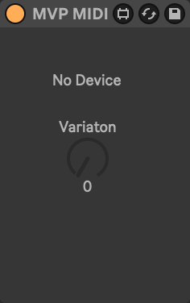

# MVP: Macro Variation Processor

There's MIDI and audio versions.

Place to the left of a MIDI or Audio Effect Rack and the `Variation` knob will control variations for that rack.

Place a different device to the right, changes MVP to controlling that device.

## Controls

MVP shows the name of the currently linked device.

- **Variation:** Change the selected macro varation of the linked device.